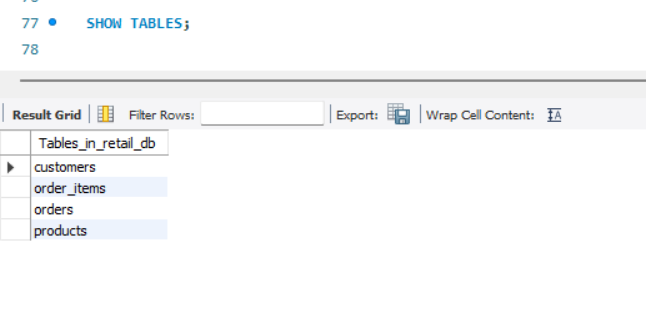
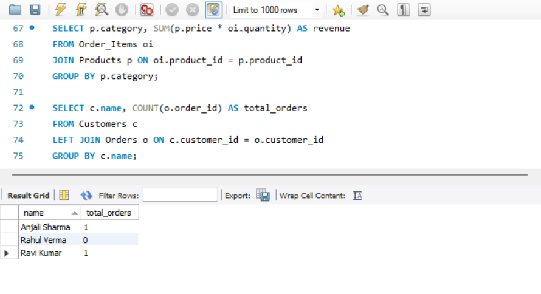

# SQL Retail Database Analysis

## Overview
This project analyzes retail sales data using SQL.

## Tools Used
- MySQL
- SQL

## Features
- Customer analysis
- Product performance
- Revenue insights

## Key Queries
- Total revenue calculation
- Top-selling products
- Customer order analysis

## Screenshots

### Tables

### Query Result

## Conclusion
This project demonstrates SQL skills including joins, aggregation, and data analysis.
